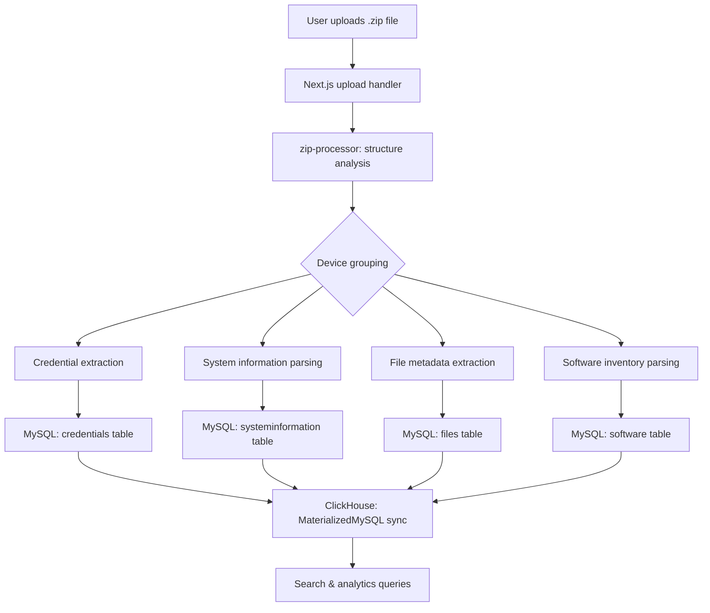

Broń Vault is built on a three-database architecture: MySQL 8.0 serves as the primary operational store for all parsed log data, ClickHouse provides a columnar analytics layer for fast credential and domain searches, and MinIO offers optional S3-compatible object storage for uploaded archive files. The Next.js application sits in front of all three, coordinating uploads, parsing, and queries through a unified web interface and REST API.

## System components

<CardGroup cols={2}>
  <Card title="Next.js application" icon="app-window">
    The web interface and API server. Handles file uploads, parsing coordination, user authentication, search queries, and webhook delivery. Runs on port 3000. Built with Next.js App Router and TypeScript.
  </Card>
  <Card title="MySQL 8.0" icon="database">
    Primary relational store for all parsed log data. Stores devices, credentials, files, software inventory, system information, domain monitors, and application settings. Configured with binary logging and GTID mode to enable ClickHouse replication.
  </Card>
  <Card title="ClickHouse" icon="bolt">
    Columnar analytics database used for credential search and domain discovery queries. Receives data automatically from MySQL via MaterializedMySQL replication. Queries that previously took seconds complete in milliseconds at scale. Accessible on port 8123.
  </Card>
  <Card title="MinIO (optional)" icon="cloud">
    S3-compatible object storage for uploaded ZIP archives. Optional — files default to local filesystem storage in the `uploads/` directory. MinIO can be configured in **Settings → Storage** after initial setup.
  </Card>
</CardGroup>

## MySQL to ClickHouse replication

ClickHouse's [MaterializedMySQL](https://clickhouse.com/docs/en/engines/database-engines/materialized-mysql) database engine connects directly to MySQL's binary log stream and replicates every committed change in real time. This means you never need to manually sync data — write once to MySQL and ClickHouse reflects the change automatically, typically within milliseconds.

For MaterializedMySQL to function, MySQL must be configured with:

- **Binary logging enabled** (`log-bin=mysql-bin`)
- **Row-based binlog format** (`binlog-format=ROW`)
- **GTID mode on** (`gtid-mode=ON`, `enforce-gtid-consistency=ON`)

All of these are set automatically by the Docker Compose configuration. The `setup` container runs once at startup to create the replication user and register the MaterializedMySQL database in ClickHouse.

<Note>
  ClickHouse sync is fully automatic. After the initial setup script completes, every INSERT, UPDATE, and DELETE that the Next.js application writes to MySQL is replicated to ClickHouse without any manual steps. Analytics queries always reflect the latest data.
</Note>

## Data flow: upload to query

The following describes the complete path a log file takes from upload to a searchable result.

1. **Upload** — the user drops a `.zip` file onto the upload interface. The file is received by the Next.js API route and passed to the ZIP processor.
2. **Structure analysis** — `zip-processor.ts` loads the archive with JSZip and uses `zip-structure-analyzer.ts` to detect the log format and group entries by device, including support for macOS-created archives.
3. **Per-device processing** — `device-processor.ts` extracts credentials, system information, installed software, and file metadata from each device's directory.
4. **MySQL write** — extracted records are bulk-inserted into MySQL in configurable batch sizes (default: 1000 credentials, 500 files, 500 password stats per batch).
5. **ClickHouse sync** — MaterializedMySQL replication propagates all MySQL changes to ClickHouse automatically.
6. **Query** — credential and domain search queries run against ClickHouse for speed; device detail views read from MySQL directly.

## Docker services

The `docker-compose.yml` defines five services that form the complete runtime environment:

| Service | Container name | Purpose | Ports |
|---|---|---|---|
| `mysql` | `bronvault_mysql` | Primary database; binary logging enabled for replication | 3306 |
| `clickhouse` | `bronvault_clickhouse` | Analytics database; receives MySQL replication stream | 8123, 9000 |
| `app` | `bronvault_app` | Next.js web application | 3000 |
| `minio` | `bronvault_minio` | Optional S3-compatible object storage | 9001 (S3), 9002 (console) |
| `setup` | `bronvault_setup` | One-shot container that configures replication and exits | — |

The `setup` service runs to completion before the `app` service starts, guaranteeing that MaterializedMySQL replication is registered and the database schema is initialised before the application accepts traffic.

## Key database tables

All tables live in MySQL and are replicated to ClickHouse via MaterializedMySQL. The core tables are:

| Table | Description |
|---|---|
| `devices` | One row per parsed device. Stores `device_id`, `device_name`, `upload_batch`, and aggregate counts for credentials, files, domains, and URLs. |
| `credentials` | All credential records. Columns include `device_id`, `url`, `domain`, `tld`, `username`, `password`, and `browser`. Indexed on `domain`, `username`, and `tld` for search performance. |
| `files` | File metadata extracted from log archives. Stores path, size, type, and an optional `local_file_path` pointing to extracted binary content on disk. |
| `software` | Installed software inventory per device. Columns include `software_name`, `version`, and `source_file`. |
| `systeminformation` | Host details per device: OS, IP address, CPU, GPU, RAM, country, hardware ID, stealer type, and log date. |
| `domain_monitors` | Domain watch configurations. Each monitor holds a list of domains, a match mode (credential, URL, or both), and links to one or more webhook endpoints. |

## Connection configuration

The Next.js application connects to MySQL and ClickHouse using lazy-initialised singleton clients defined in `lib/mysql.ts` and `lib/clickhouse.ts`. Both clients read all credentials exclusively from environment variables — no hardcoded fallbacks. Required variables are validated at first use; a missing variable throws a descriptive error rather than failing silently.

The MySQL connection pool is configured with a limit of 50 connections and unlimited queue depth to handle concurrent uploads without dropping requests under load.

## Related pages

<CardGroup cols={2}>
  <Card title="Quick start" icon="rocket" href="/quickstart">
    Run all services with a single Docker Compose command
  </Card>
  <Card title="Environment variables" icon="sliders" href="/configuration/environment-variables">
    Full reference for MySQL, ClickHouse, and storage configuration
  </Card>
  <Card title="Docker setup" icon="docker" href="/operations/docker-setup">
    Detailed Docker operations, health checks, and service management
  </Card>
  <Card title="API reference" icon="code" href="/api/overview">
    REST API v1 for programmatic upload and search
  </Card>
</CardGroup>
